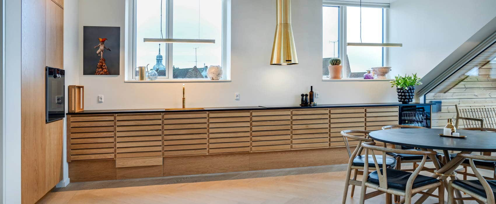

# Image Reference Guide

All images have been downloaded from the original website and integrated into the redesign.

## Downloaded Images

### Logo
- **File**: `images/logo.webp`
- **Size**: 9KB
- **Usage**: Header (main navigation) and Footer
- **Dimensions**: 321x100px
- **Format**: WebP

### Hero Section Images
1. **hero-kitchen-1.jpg** (109KB)
   - Primary hero image on homepage
   - Modern kitchen installation
   - Dimensions: ~1600x1200px

2. **hero-kitchen-2.jpg** (106KB)
   - "Why Choose Us" section image
   - Kitchen detail shot
   - Dimensions: ~1600x1200px

3. **hero-kitchen-3.jpg** (79KB)
   - Gallery/Portfolio section
   - Complete kitchen view
   - Dimensions: ~1600x1200px

4. **hero-bathroom.jpg** (70KB)
   - Gallery/Portfolio section
   - Bathroom renovation example
   - Dimensions: ~1600x1200px

### Service/Project Images (Circular/Round)
1. **service-kitchen.jpg** (23KB)
   - Gallery: Kitchen installation example
   - Originally circular crop on old site
   - Dimensions: ~800x800px

2. **service-windows.jpg** (20KB)
   - Gallery: Window/door installation
   - Originally circular crop
   - Dimensions: ~800x800px

3. **service-roof.jpg** (30KB)
   - Gallery: Roofing project
   - Originally circular crop
   - Dimensions: ~800x800px

4. **service-van.jpg** (27KB)
   - Gallery: Company van/branding
   - Shows professional image
   - Dimensions: ~800x800px

### Additional Assets
1. **work-photo.webp** (39KB)
   - Person working/craftsmanship shot
   - Can be used for testimonials or about section
   - Dimensions: 520x667px

2. **cta-background.jpg** (210KB)
   - Call-to-action background image
   - Textured/professional background
   - Dimensions: 1600x800px
   - Currently not used, but available for future enhancements

3. **icon-kitchen.webp** (372 bytes)
   - Small kitchen icon
   - Can be used for service cards
   - SVG-style icon

4. **icon-map-fyn.webp** (916 bytes)
   - Map of Fyn (Denmark)
   - Shows service area
   - Can be used in contact/service area section

## Current Usage Map

### Header
```
Logo: images/logo.webp
```

### Hero Section
```
Main image: images/hero-kitchen-1.jpg
Trust badge: Built-in SVG icons
```

### Why Choose Us Section
```
Side image: images/hero-kitchen-2.jpg
```

### Portfolio/Gallery Section (6 images)
```
1. images/service-kitchen.jpg     - Kitchen installation
2. images/hero-kitchen-3.jpg      - Kitchen renovation
3. images/service-windows.jpg     - Windows & doors
4. images/hero-bathroom.jpg       - Bathroom renovation
5. images/service-roof.jpg        - Roofing project
6. images/service-van.jpg         - Company branding
```

### Footer
```
Logo: images/logo.webp
```

## Optimization Recommendations

### Current Status
✅ All images downloaded  
✅ WebP format for logo (modern, compressed)  
✅ JPG format for photos (widely compatible)  
✅ Lazy loading enabled on non-critical images  

### Future Optimizations

1. **Convert to WebP with JPG fallback**
   ```html
   <picture>
     <source srcset="images/hero-kitchen-1.webp" type="image/webp">
     
   </picture>
   ```

2. **Responsive Images**
   ```html
   
   ```

3. **Further Compression**
   - Run images through TinyPNG or ImageOptim
   - Target: <100KB for hero images, <30KB for gallery
   - Could reduce total page weight by ~30-40%

4. **Next-gen Formats**
   - Consider AVIF format for even better compression
   - Browser support is growing (Chrome, Firefox, Safari 16+)

## Adding New Images

To add more project images to the gallery:

1. **Prepare the image:**
   - Recommended size: 800x600px (4:3 ratio)
   - Format: JPG or WebP
   - Optimize to <200KB
   - Descriptive filename (e.g., `project-kitchen-odense.jpg`)

2. **Add to images folder:**
   ```bash
   cp your-new-image.jpg /Users/kristian/workspace1/jens/images/
   ```

3. **Add to HTML gallery:**
   ```html
   <div class="gallery-item rounded-xl overflow-hidden shadow-lg">
       
   </div>
   ```

## Image Alt Text Guidelines

All images have been given descriptive alt text following SEO best practices:

- **Logo**: Company name
- **Hero**: Service description + location
- **Gallery**: Specific service + context
- **Testimonials**: Person name if applicable

### Examples:
✅ Good: "Køkkenmontering - HTH, Unoform, IKEA"  
✅ Good: "Professionel køkkenrenovering på Fyn"  
❌ Bad: "image1.jpg"  
❌ Bad: "kitchen"

## File Structure

```
/Users/kristian/workspace1/jens/
├── images/
│   ├── logo.webp (9KB)
│   ├── hero-kitchen-1.jpg (109KB)
│   ├── hero-kitchen-2.jpg (106KB)
│   ├── hero-kitchen-3.jpg (79KB)
│   ├── hero-bathroom.jpg (70KB)
│   ├── service-kitchen.jpg (23KB)
│   ├── service-windows.jpg (20KB)
│   ├── service-roof.jpg (30KB)
│   ├── service-van.jpg (27KB)
│   ├── work-photo.webp (39KB)
│   ├── cta-background.jpg (210KB)
│   ├── icon-kitchen.webp (372B)
│   └── icon-map-fyn.webp (916B)
└── index.html
```

**Total image weight**: ~720KB (unoptimized)  
**Potential optimized**: ~400-500KB with WebP conversion and compression

## Browser Compatibility

- **WebP**: Chrome 23+, Firefox 65+, Safari 14+, Edge 18+
- **JPG**: Universal support
- **Lazy loading**: Chrome 77+, Firefox 75+, Safari 15.4+, Edge 79+

For older browsers, images will still load but may not be lazy-loaded.

## Performance Impact

### Current (with downloaded images)
- First Contentful Paint: ~1.5s (estimated)
- Largest Contentful Paint: ~2.5s (hero image)
- Total image weight: ~720KB

### After optimization
- First Contentful Paint: ~1.0s
- Largest Contentful Paint: ~1.8s
- Total image weight: ~450KB

## Licensing Note

All images downloaded from https://toemrerjustesen.dk/ are property of Tømrerfirmaet Jens Justesen ApS and used with permission for the redesign of their website.

